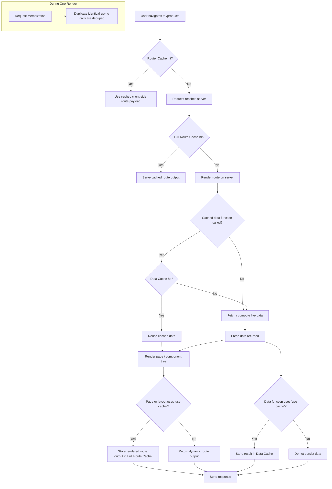
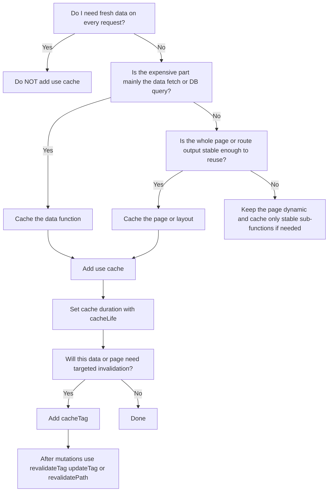

# Next.js 16 Cache Components Cheat Sheet

> **Scope:** This note is for **Next.js 16** with `cacheComponents: true` enabled.  
> It covers the **Cache Components** model only and is written as a practical reference page.

---

# 1) The 4 Caching Mechanisms — Core Mental Model

## Quick Summary Table

| Mechanism | Lives | Stores | Default Lifetime | Enabled By |
|---|---|---|---|---|
| **Request Memoization** | Server | Duplicate async work during one render | Current request only | Automatic deduplication during render |
| **Data Cache** | Server | Cached function / data results | Configured with `cacheLife()` | `'use cache'` |
| **Full Route Cache** | Server | Cached rendered route output | Controlled by cached route behavior + invalidation | `'use cache'` on page/layout/boundary |
| **Router Cache** | Client | Prefetched / visited route segments for navigation | Temporary browser/session cache | App Router navigation + prefetching |

---

## A. Request Memoization

**What it is:** per-request deduplication of identical async work during a single render.

- **Lives:** Server
- **Stores:** the result of identical requests / async calls during one render
- **Lifetime:** only for the current request render
- **Enabled by:** built-in render-time deduplication

```tsx
async function getUser(id: string) {
  const res = await fetch(`https://api.example.com/users/${id}`)
  return res.json()
}

export default async function Page() {
  const a = getUser('1')
  const b = getUser('1') // deduped in the same render
  const [user1, user2] = await Promise.all([a, b])

  return <pre>{JSON.stringify(user1, null, 2)}</pre>
}
```

**Important:** this is **not persistent caching**. It only avoids duplicate work **within one request**.

---

## B. Data Cache

**What it is:** persistent server cache for **raw data / function results**.

- **Lives:** Server
- **Stores:** return values of cached functions / cached data reads
- **Lifetime:** whatever you configure via `cacheLife()`
- **Enabled by:** `'use cache'` inside a function/component

```tsx
import { cacheLife, cacheTag } from 'next/cache'

export async function getProducts() {
  'use cache'
  cacheLife('minutes')
  cacheTag('products')

  const res = await fetch('https://api.example.com/products')
  return res.json()
}
```

---

## C. Full Route Cache

**What it is:** cached **rendered output of a route**.

- **Lives:** Server
- **Stores:** rendered route output for a cached route tree
- **Lifetime:** tied to the route’s cached content and its invalidation / expiration
- **Enabled by:** caching the page/layout/render path with `'use cache'`

```tsx
import { cacheLife, cacheTag } from 'next/cache'
import { getProducts } from '@/lib/data'

export default async function ProductsPage() {
  'use cache'
  cacheLife('hours')
  cacheTag('products-page')

  const products = await getProducts()
  return <ProductsList products={products} />
}
```

### Rule of thumb
- Cache a **data function** → you get **Data Cache**
- Cache a **page/layout boundary** → you allow **route output** to be cached too

---

## D. Router Cache

**What it is:** client-side route cache for fast navigation.

- **Lives:** Client / browser
- **Stores:** previously visited or prefetched route segments / route payload used for navigation
- **Lifetime:** temporary browser/session cache
- **Enabled by:** App Router navigation + prefetching behavior

```tsx
import Link from 'next/link'

export function Nav() {
  return (
    <nav>
      <Link href="/dashboard">Dashboard</Link>
      <Link href="/products">Products</Link>
    </nav>
  )
}
```

---

# 2) Default Behavior — The Crucial Rule

With **`cacheComponents: true`**, **nothing is cached by default** in the server caching model.

That means:

- pages are **dynamic by default**
- data reads are **dynamic by default**
- route output is **dynamic by default**
- code runs again on every request **unless you explicitly opt into caching**

## Mental model
> **No server caching happens unless you add `'use cache'`.**

This is the key idea to keep in your head when working with Next.js 16 caching.

---

# 3) Enabling Caching — `'use cache'`

`'use cache'` is the **main switch** that turns server caching on.

You can place it in:

- a **data function**
- a **page**
- a **layout**
- another **server component boundary**

---

## A. Cache a specific data function

Use this when you want to cache **raw data**.

```tsx
// lib/data.ts
import { cacheLife, cacheTag } from 'next/cache'

export async function getProduct(id: string) {
  'use cache'
  cacheLife('hours')
  cacheTag(`product:${id}`)

  const res = await fetch(`https://api.example.com/products/${id}`)
  return res.json()
}
```

### Result
- the function result is stored in the **Data Cache**
- later requests can reuse it until invalidated / expired

---

## B. Cache a page component

Use this when you want to cache **the rendered route output**.

```tsx
// app/products/[id]/page.tsx
import { cacheLife, cacheTag } from 'next/cache'
import { getProduct } from '@/lib/data'

export default async function ProductPage({
  params,
}: {
  params: Promise<{ id: string }>
}) {
  'use cache'
  cacheLife('hours')

  const { id } = await params
  cacheTag(`product-page:${id}`)

  const product = await getProduct(id)

  return (
    <main>
      <h1>{product.name}</h1>
      <p>{product.description}</p>
    </main>
  )
}
```

### Result
- the page becomes cacheable
- its rendered output can be reused
- nested cached reads can also participate in the Data Cache

---

# 4) Configuring Cache Duration & Invalidation Tags

The two core tools are:

- **`cacheLife()`** → controls **how long** a cached entry can live
- **`cacheTag()`** → assigns **labels** for targeted invalidation

---

## A. `cacheLife()` — time-based expiration

Use `cacheLife()` **inside a cached scope** (`'use cache'`).

```tsx
import { cacheLife } from 'next/cache'

export async function getNews() {
  'use cache'
  cacheLife('minutes')
  return fetch('https://api.example.com/news').then(r => r.json())
}
```

### Common presets

Use named lifetimes such as:

- `seconds`
- `minutes`
- `hours`
- `days`
- `max`

```tsx
import { cacheLife } from 'next/cache'

export async function getCatalog() {
  'use cache'
  cacheLife('days')
  return fetch('https://api.example.com/catalog').then(r => r.json())
}
```

### Practical guideline
- **seconds / minutes** → frequently changing dashboards, feeds
- **hours** → product lists, CMS content that changes a few times per day
- **days / max** → near-static marketing content, docs, config-like data

---

## B. `cacheTag()` — targeted invalidation labels

```tsx
import { cacheLife, cacheTag } from 'next/cache'

export async function getPost(slug: string) {
  'use cache'
  cacheLife('hours')
  cacheTag('posts')
  cacheTag(`post:${slug}`)

  const res = await fetch(`https://api.example.com/posts/${slug}`)
  return res.json()
}
```

### Good tag patterns

Use predictable tag names:

- `posts`
- `post:my-slug`
- `products`
- `product:123`
- `user:42`
- `dashboard:analytics`

### Recommendation
Use:
- **broad tags** for list pages: `products`
- **granular tags** for detail pages/items: `product:123`

---

# 5) Revalidation — Updating Stale Data

Cached data becomes fresh again in two ways:

1. **Time-based revalidation** → via `cacheLife()`
2. **On-demand revalidation** → via `revalidateTag()`, `updateTag()`, `revalidatePath()`

---

## A. Time-based revalidation

```tsx
import { cacheLife } from 'next/cache'

export async function getExchangeRates() {
  'use cache'
  cacheLife('minutes')
  return fetch('https://api.example.com/rates').then(r => r.json())
}
```

Use this when the data changes on a known cadence.

---

## B. On-demand revalidation

Use this when **you know something changed**—for example after a DB write, admin edit, webhook, or Server Action mutation.

---

## `revalidateTag(tag)` — mark tagged cache as stale

```tsx
'use server'

import { revalidateTag } from 'next/cache'

export async function createProduct() {
  // write to DB...
  revalidateTag('products')
}
```

### Mental model
**`revalidateTag('products')`**  
= “Everything tagged `products` is stale now.”

Use this when:
- a collection changed
- a detail record changed and you tagged related data

---

## `updateTag(tag)` — immediate refresh intent for tagged cache

```tsx
'use server'

import { updateTag } from 'next/cache'

export async function updateProduct(id: string, data: FormData) {
  // write to DB...
  updateTag(`product:${id}`)
  updateTag('products')
}
```

### Distinction
- **`revalidateTag(tag)`** → **mark stale**
- **`updateTag(tag)`** → **refresh/update now**

### Quick rule
- use **`revalidateTag`** when “the next read can refresh it”
- use **`updateTag`** when “this mutation should immediately push cache freshness forward”

---

## `revalidatePath(path)` — invalidate by route path

```tsx
'use server'

import { revalidatePath } from 'next/cache'

export async function saveSettings(formData: FormData) {
  // write to DB...
  revalidatePath('/dashboard/settings')
}
```

Use this when the update is naturally tied to a **specific route**.

---

## Practical invalidation patterns

### Pattern 1: a list changed
```tsx
'use server'
import { revalidateTag } from 'next/cache'

export async function createPost() {
  // insert into DB
  revalidateTag('posts')
}
```

### Pattern 2: a single item changed
```tsx
'use server'
import { updateTag } from 'next/cache'

export async function editPost(slug: string) {
  // update DB
  updateTag(`post:${slug}`)
  updateTag('posts')
}
```

### Pattern 3: a route UI must refresh
```tsx
'use server'
import { revalidatePath } from 'next/cache'

export async function updateProfile() {
  // update DB
  revalidatePath('/account')
}
```

---

# 6) Opting Out — Dynamic Data

To keep something dynamic, **do nothing**.  
Just **omit** `'use cache'`.

---

## Dynamic function example

```tsx
export async function getLiveStockPrice(symbol: string) {
  const res = await fetch(`https://api.example.com/stocks/${symbol}`)
  return res.json()
}
```

Because there is **no** `'use cache'`:
- no Data Cache entry is created
- the read happens fresh per request

---

## Dynamic page example

```tsx
import { getLiveStockPrice } from '@/lib/data'

export default async function StockPage() {
  const stock = await getLiveStockPrice('AAPL')
  return <div>{stock.price}</div>
}
```

Because the page itself is **not** marked with `'use cache'`:
- it stays dynamic
- it rerenders per request

---

# 7) Visual Flowchart — How the 4 Caches Relate



## How to read the flow

### 1) Router Cache
The browser may already have the route payload from a previous visit or prefetch.  
If it does, navigation can complete immediately without needing a new server render.

### 2) Full Route Cache
If the browser does not have what it needs, the request reaches the server.  
The server then checks whether the **rendered route output** is already cached.

### 3) Data Cache
If the route must render, any cached data functions may reuse their stored results instead of refetching or recomputing.

### 4) Request Memoization
While a single request is rendering, repeated identical async calls are automatically deduplicated.  
This is **per-render only** and is not a persistent cache.

---

# 8) “When Should I Cache This?” Decision Tree



---

# 9) Practical Decision Rules

## Cache a **data function** when…
Use `'use cache'` on a function like `getProducts()` if:

- multiple pages or components reuse the same data
- the expensive part is the **database query** or **API request**
- the page may still be dynamic, but the data itself is stable enough to reuse
- you want to invalidate the data by tag later

```tsx
import { cacheLife, cacheTag } from 'next/cache'

export async function getProducts() {
  'use cache'
  cacheLife('hours')
  cacheTag('products')

  return db.product.findMany()
}
```

---

## Cache a **page or layout** when…
Use `'use cache'` on the route component if:

- the **rendered route output** is stable enough to reuse
- rendering the page is expensive
- you want the route itself to be served from cache instead of rerendering on each request

```tsx
import { cacheLife } from 'next/cache'
import { getProducts } from '@/lib/data'

export default async function ProductsPage() {
  'use cache'
  cacheLife('hours')

  const products = await getProducts()
  return <ProductsList products={products} />
}
```

---

## Keep it **dynamic** when…
Do **not** use `'use cache'` if:

- the data must always be fresh per request
- the output depends on request-specific values that should not be reused
- the content changes too frequently to benefit from caching

```tsx
export async function getLivePrice(symbol: string) {
  const res = await fetch(`https://api.example.com/stocks/${symbol}`)
  return res.json()
}
```

---

# 10) Recommended Mental Shortcut

When deciding what to cache in Next.js 16, ask these three questions in order:

## Q1 — Can this be stale for a while?
- **No** → keep it dynamic
- **Yes** → continue

## Q2 — Is the expensive part the data fetch, or the full page render?
- **Data fetch / DB query** → cache the **function**
- **Whole page render / route output** → cache the **page or layout**

## Q3 — How will I refresh it?
- predictable interval → `cacheLife()`
- after writes, admin edits, or webhooks → `cacheTag()` + `revalidateTag()` / `updateTag()` / `revalidatePath()`

---

# 11) Ultra-Short Cheat Version

## Cache the **function** if:
> The data is expensive and reusable.

## Cache the **page** if:
> The whole rendered route is stable and expensive.

## Cache **nothing** if:
> The content must always be fresh.

---

# 12) Canonical Example

```tsx
// lib/products.ts
import { cacheLife, cacheTag } from 'next/cache'

export async function getProducts() {
  'use cache'
  cacheLife('hours')
  cacheTag('products')

  const res = await fetch('https://api.example.com/products')
  return res.json()
}
```

```tsx
// app/products/page.tsx
import { cacheLife } from 'next/cache'
import { getProducts } from '@/lib/products'

export default async function ProductsPage() {
  'use cache'
  cacheLife('hours')

  const products = await getProducts()
  return <ProductsList products={products} />
}
```

```tsx
// app/actions.ts
'use server'

import { revalidateTag, revalidatePath } from 'next/cache'

export async function createProduct() {
  // mutate DB...
  revalidateTag('products')
  revalidatePath('/products')
}
```
